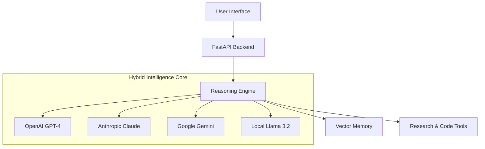

# 🧠 Z3ube: The Hybrid AI Agent

<div align="center">

> **A Next-Generation AI Agent System combining Local & Cloud Intelligence**
> *OpenAI GPT-4 • Anthropic Claude 3.5 • Google Gemini 3 Flash • Local Llama 3.2*


</div>

---

## 🚀 Overview

**Z3ube** is an advanced AI agent framework designed to solve complex problems by leveraging a **hybrid multi-model architecture**. Instead of relying on a single AI provider, Z3ube intelligently rotates through four distinct "brains" to provide diverse perspectives, enhanced reasoning, and maximum reliability.

It features a **privacy-first design** with local model integration via Ollama, ensuring sensitive reasoning steps can happen entirely on your machine.

---

## 🧠 The 4-Brain Hybrid Engine

Z3ube's reasoning engine cycles through these state-of-the-art models for every complex task:

| Step | Provider | Model | Role |
|------|----------|-------|------|
| **1** | 🏠 **Local** | **Llama 3.2 3B** | **Speed & Privacy** - Rapid initial thought generation |
| **2** | 🌐 **OpenAI** | **GPT-4** | **Logic & Strategy** - Deep reasoning and decomposition |
| **3** | 🌍 **Anthropic** | **Claude 3.5 Sonnet** | **Nuance & Planning** - Creative problem solving |
| **4** | ⚡ **Google** | **Gemini 3 Flash** | **Context & Synthesis** - Frontier speed & reasoning |
| **5** | 🐳 **Deepseek** | **Deepseek-V3** | **Efficiency & Cost** - High-performance reasoning |

---

## ✨ Key Features

### 🧠 Advanced Intelligence
- **Hybrid Reasoning Engine**: Cycles through **Gemini 3 Flash** (Speed), **GPT-4** (Logic), **Claude 3.5** (Nuance), and **Llama 3.2** (Privacy) to solve complex problems.
- **🛡️ Auto-Healing**: The system proactively detects errors in its own code and attempts to fix them automatically.
- **📚 Self-Learning 2.0**: Remembers every interaction and improves over time using **Vector Database** memory.

### 🖥️ World-Class Interface
- **📊 Neural Dashboard**: Real-time visualization of system health, learning metrics, and active reasoning chains.
- **🕸️ 3D Knowledge Graph**: Interactive exploration of the AI's internal knowledge base.
- **🤖 Robotics Studio**: Dedicated environment for generating and visualizing ROS2/Arduino projects.
- **💻 Cyberpunk UI**: A stunning, hacker-style frontend built with Next.js and Tailwind CSS.

### ⚡ Infrastructure
- **☁️ Cloud Persistence**: Seamlessly syncs memory to PostgreSQL/Supabase for permanent learning.
- **🔄 Recursive Forecasting**: Predicts future steps and outcomes before executing actions.
- **🌐 Autonomous Research**: Can browse the web to gather real-time information.

---

## 🛠️ Installation

### Prerequisites
- Python 3.10 or 3.11
- Node.js 18+
- [Ollama](https://ollama.com/) (for local AI)

### 1. Clone the Repository
```bash
git clone https://github.com/foodpedia25/Z3ube.git
cd Z3ube
```

### 2. Setup Backend
```bash
# Create virtual environment
python3 -m venv venv
source venv/bin/activate

# Install dependencies (Use local requirements for full features)
pip install -r requirements-local.txt
```

### 3. Configure Environment
Create a `.env` file in the root directory:
```bash
cp .env.example .env
```
Fill in your API keys (OpenAI, Anthropic, Google) in `.env`.

### 4. Setup Local AI (Ollama)
```bash
# Install Llama 3.2 3B (Optimized for speed & FAT32 drives)
ollama pull llama3.2:3b
```

### 5. Run the System

**Backend (API & AI Engine):**
```bash
source venv/bin/activate
uvicorn api.main:app --reload --port 8000
```

**Frontend (UI):**
```bash
cd frontend
npm install
npm run dev
```

Visit `http://localhost:3000` to enter the Matrix. 🐰🕳️

---

## 🧪 Testing

Run the verification scripts to ensure everything is connected:

```bash
# Verify system setup & API keys
python test_setup.py

# Verify Local AI integration
python test_ollama.py

# Verify Gemini integration
python test_gemini.py
```

---

## 🏗️ Architecture



---


## 📚 Documentation

- **[Installation Guide](SETUP.md)**: Extended setup instructions.
- **[Quick Start](QUICKSTART.md)**: How to use the features.
- **[Deployment Guide](DEPLOYMENT.md)**: Getting into production on Vercel.
- **[Launch Checklist](LAUNCH.md)**: Production readiness.

---

## 🤝 Contributing

Contributions are welcome! Please feel free to submit a Pull Request.

1. Fork the project
2. Create your feature branch (`git checkout -b feature/AmazingFeature`)
3. Commit your changes (`git commit -m 'Add some AmazingFeature'`)
4. Push to the branch (`git push origin feature/AmazingFeature`)
5. Open a Pull Request

---

<div align="center">
Built with ❤️ by the Z3ube Team
</div>
